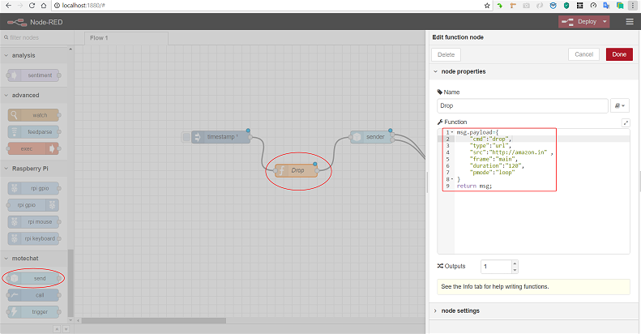
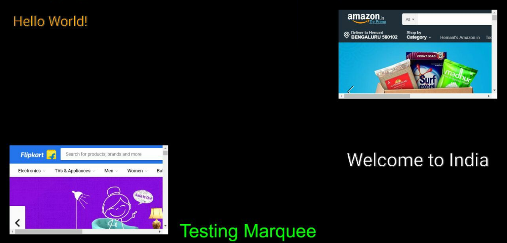
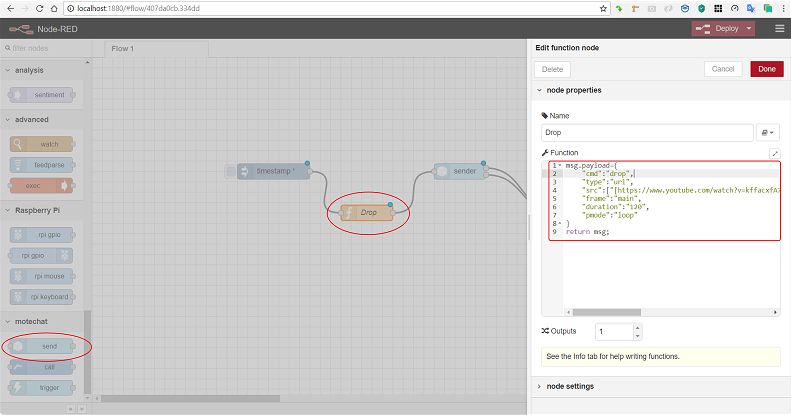
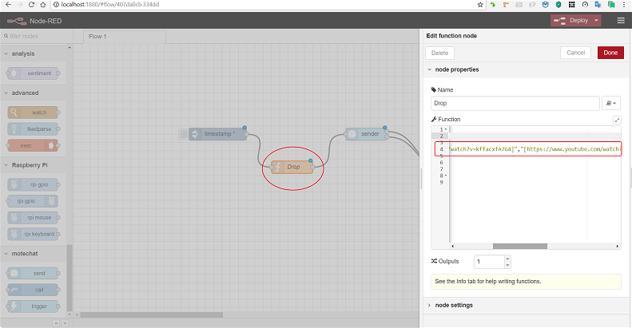

# Building Flows for SmartScreen - 'drop'

## 'drop'

#### Drop a URL - _Site, Portal, Media - Video, Audio, Images_ - individually or collectively as a _playlist/ slideshow_ on the SS _frame_ of your choice

Individual _URL_ on to __SS _frame \#2_

See the _URL_ dropped on _frame \#2_ of SS

Also shown above are the _marquee_ function as well as a _second URL_ pushed to _frame \#3_ while texts pushed to _frame \#1_ and _4..._go ahead & try it for yourself!

A _SlideShow_ of online Videos, _four_ in all, _each played for 2 mins_, with the show being _repeated_

