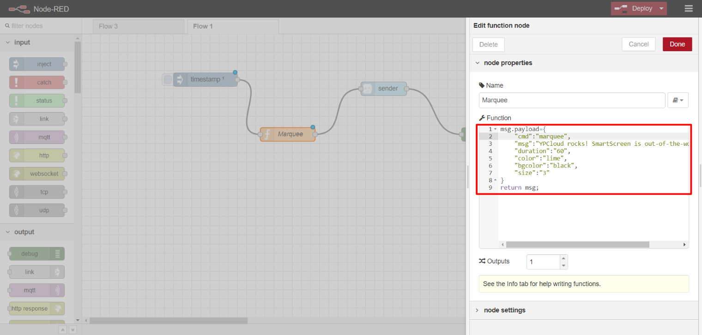
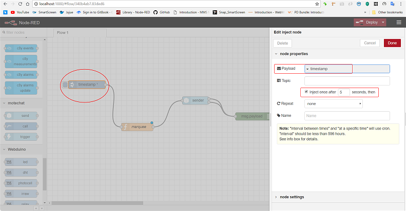

# Building Flows for SmartScreen - 'marquee'

## 'marquee'

#### _Scrolling text_ horizontally with _user-defined attributes_ for a _user-defined duration_ at the bottom of the _main_ frame

Configure NR standard function node,_function,_ to create suitable _message payload_ using SS command, _marquee_

Configure _MoteChat Sender_ node suitably to define the _SS\_target\_device_

Configure NR standard input node, _inject,_ to define the _Msg\_PayLoad_ \(to be injected\) as _timestamp_. It is preferred to introduce a _delay_ \(can be in ms\) as shown below for reliable deployment of the flow

