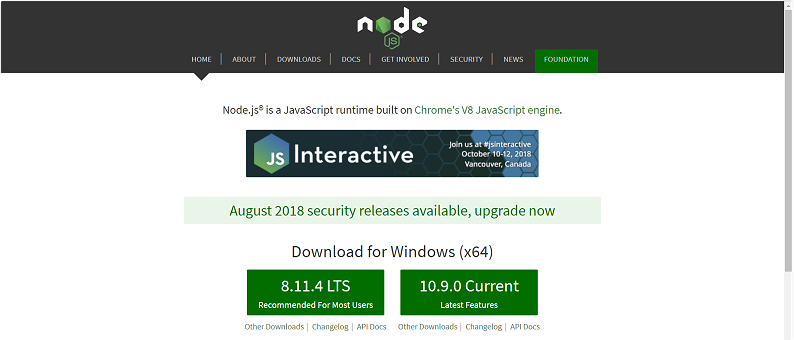
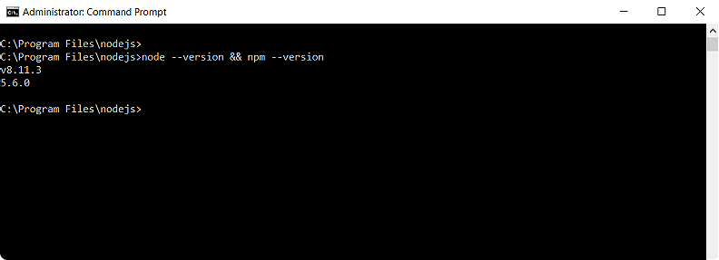
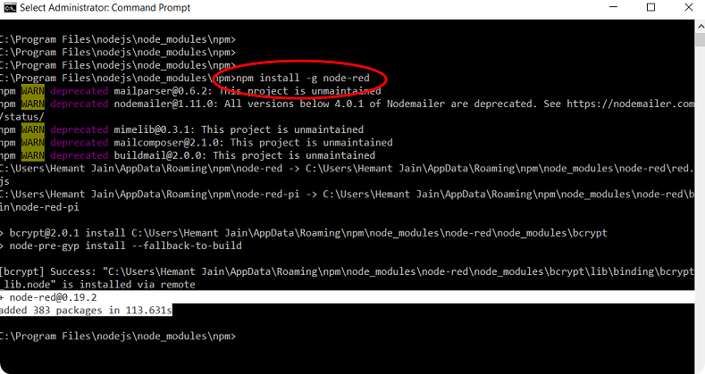

# FlowBot Environment for Windows - Nodejs, NPM & Node-RED

## Install Node.js \(v8.x LTS\)

 In the Administrator mode, install _v8.11.4 LTS_ \(Long Term Support\) release of _Nodejs_ from:

```text
https://nodejs.org/en
```



## Check Node.js & NPM \(Node Package Manager\) installation status

Use _PowerShell_ on _Windows_ to check the versions of installed _Nodejs_ and _NPM_  

```text
node --version; npm --version
```

or _Cmd_

```text
node --version && npm --version
```



## Install Node-RED using NPM as a global module

```text
npm install -g --unsafe-perm node-red
```




