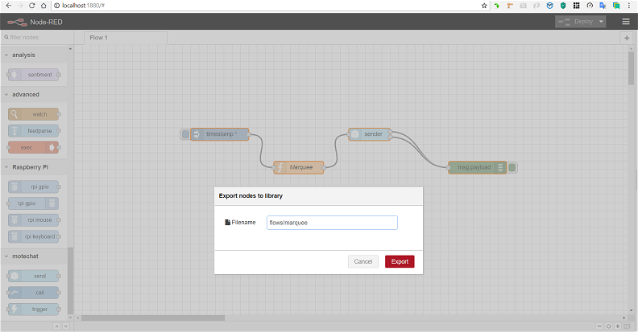

# Saving Flows and Functions

## Saving your _flows_ and _functions_

Select _all the nodes_ \(by selecting _one at one end --&gt; Ctrl+Shift+selecting the last one at the other end_\), then _exporting_ the _flow_ to _library_ as shown above

_Library_ path

Likewise you can save _individual functions \(nodes\)_ by selecting them & _exporting_ to _library_, say under a separate folder _functions_

